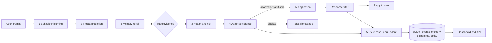

# AstraSec: Artificial Immune System for Autonomous AI Threat Prediction, Adaptive Defense and Self-Healing

Final-year project report. Team: Harshita U (leader), Harini S, Mahalakshmi S. Guide: Mr. B. Thiyagarajan, Department of Computer Science and Engineering, Sri Manakula Vinayagar Engineering College.

## 1. Summary

AstraSec is a security layer that sits between users and an AI application (for example a customer-support chatbot). It watches every prompt and every reply, decides whether the traffic is safe, applies a defence when it is not, and keeps a memory of what it has seen so that it defends better next time. The design follows the human immune system: recognise what is normal, notice what is foreign, respond proportionately, and remember.

The system is a working implementation, not a mock-up: five modules with trained models, a REST API, a web dashboard, an automated test suite (118 tests) and an independent red-team evaluation. Section 8 states plainly what the evaluation does and does not show.

## 2. Problem and objectives

The project brief identifies these problems: existing AI security tools react after an attack instead of predicting it; they solve one task (scanning or detection) instead of protecting continuously; they do not learn what normal looks like; and they rarely improve after meeting a new attack.

The objectives, and where each is met:

| Objective (from the brief) | Where it is met |
|---|---|
| Continuously learn normal behaviour of AI applications | Module 1: Isolation Forest baseline, per-client rate and length statistics, refit on confirmed-safe traffic |
| Predict prompt injection, jailbreak and adversarial inputs before they cause harm | Module 3: classifier plus signatures; model extraction added as a fourth class |
| Automatically select and apply a defence | Module 4: policy table, sanitiser, masking, rate limiting, quarantine, response filter |
| Build an immune memory that improves security policy | Module 5: case memory, signature mining, threshold adaptation, policy escalation, retraining |
| Provide health scores, analytics and recommendations in a dashboard | Module 2 and the web dashboard; Llama 3.1 or rule-based recommendations |

## 3. Architecture



The modules are numbered as in the brief. Module 5 both reads (recall of similar past attacks influences the decision) and writes (every attack is stored, and repeated attacks trigger learning).

Fusion rule: the final label combines the classifier probabilities, signature hits, memory recall and behavioural anomaly. A request that is anomalous but matches nothing known is marked as an **emerging threat** and shown to analysts rather than silently passed. Repeated attacks from one client raise the severity of the next one.

## 4. The five modules

### Module 1: Behaviour learning engine (`engines/behavior.py`)

- **Prompt baseline.** Each prompt becomes 24 numeric features (length, entropy, share of symbols, imperative openings, override keywords, sensitive keywords, encoded-looking runs, invisible characters and so on). An Isolation Forest of 300 trees is trained on **benign prompts only**, so it never needs labelled attacks. Raw forest scores are turned into a 0 to 1 anomaly score by their position in the benign score distribution. The top deviating features are reported as z-scores so the alert can be explained.
- **API monitor.** Per-client request rate, and running mean and variance (Welford's method) of prompt and reply length, flag bursts and unusual payload sizes.
- **Continual learning.** Prompts confirmed safe are buffered and the baseline is refitted every 200.
- **Hidden payloads.** Before features are computed, `features.py` normalises Unicode, removes invisible characters and homoglyphs, and peels base64, hex, URL and unicode escapes, ROT13, reversed text, leetspeak and scrambled words. The decoded view is what the other modules read.

### Module 2: AI health and risk analyzer (`engines/risk.py`)

- **Per request:** risk score and level, whether the prompt is sensitive, whether it could expose confidential data, whether it violates policy, and the reasons. These are the three questions in the brief's worked example.
- **Whole application:** the AI Health Score is `100 x (1 - sum of weight x component risk)` over four components with weights prompts 0.35, API traffic 0.20, configuration 0.25, dependencies 0.20. The weights are chosen by design judgement, not learned.
  - *Prompts:* recent attack pressure, counting attacks that got through the defence more heavily than contained ones.
  - *API:* burst traffic, quarantined clients, extraction probing.
  - *Configuration:* 16 audit rules (secrets in the system prompt, no authentication, no TLS, public model endpoint, write-capable tools without approval, unverified model files and others), each with a severity and a fix.
  - *Dependencies:* `requirements.txt` is checked against a bundled advisory snapshot (`data/advisories.json`). A live OSV.dev lookup function exists but is not used by default.
- **Register:** all findings sorted by severity, each with a concrete fix.

### Module 3: Threat prediction engine (`engines/threat.py`, `signatures.py`)

- **Features:** word TF-IDF (1 to 2 grams), character TF-IDF (3 to 5 grams, word-bounded, which resists spelling tricks) and the 24 behavioural features, giving 29,170 features.
- **Classifiers compared:** logistic regression, random forest and a soft-voting ensemble, chosen by cross-validation (Section 5). Logistic regression won.
- **Signatures:** 42 hand-written regular expressions across the four attack classes. Two were deliberately narrowed after error analysis so that questions such as "what is a jailbreak" are not flagged.
- **Fusion:** probabilities and signature weights are combined. Severity comes from the class and the confidence. The output lists the words and signatures that drove the decision.

### Module 4: Adaptive defence engine (`engines/defense.py`)

- **Policy table:** each (attack type, severity) pair maps to one of five actions: allow, mask, sanitise, rate-limit, block. The table is stored in the database and can be edited in the dashboard.
- **Sanitiser:** decodes embedded payloads, strips hidden markup and role tags, drops hostile clauses one at a time (each clause is scored by the classifier), then **re-scores what is left**. If it is still hostile, or nothing benign remains, the request is blocked. This is the "validate the cleaned prompt, reject if still unsafe" step from the brief.
- **Masking:** emails, phone numbers and Luhn-valid card numbers are replaced before the model sees them.
- **Rate guard:** a token bucket per client; three flagged attacks within five minutes put the client in quarantine for two minutes.
- **Guard reminder:** when a request is forwarded after sanitising or under rate limiting, a security reminder is added to the system prompt.
- **Response filter:** replies are checked for protected strings, secret patterns (API keys, private keys, passwords), overlap with the system prompt, numeric dumps typical of model extraction, and jailbreak-compliance markers. Leaks are withheld. This is a second line of defence: on the first red-team set, 19 attacks passed the input check, the response filter stopped 14 of them, and the remaining 5 were caught by neither layer (the demo assistant did not act on those 5, so no attack produced an unsafe reply).
- **Escalation:** if a policy row's defence keeps failing (more than 30% of at least 6 cases), the row moves one step stricter automatically.

### Module 5: Self-healing and security intelligence engine (`engines/memory.py`)

- **Immune memory:** each attack is stored with its type, severity, the defence used and whether it worked. New prompts are compared with memory by character n-gram cosine similarity, so reworded attacks are recognised. Near-duplicates reinforce an existing case.
- **Signature learning:** word n-grams that recur across stored attacks and never appear in a benign reference corpus become new signatures (`LN-` ids). A learned signature is retired automatically after two false-alarm reports.
- **Llama 3.1 rule proposals (optional):** the model suggests regular expressions for missed attacks. Each is checked for catastrophic backtracking, must match the attack, and must not match any benign reference prompt. Accepted proposals stay **pending** until a person approves them.
- **Analyst feedback:** three verdicts (false alarm, missed attack, confirm). They correct memory, retire bad signatures and move the detection threshold within a fixed range (0.35 to 0.70).
- **Retraining ("vaccination"):** the classifier is refitted on the original data plus confirmed attacks and confirmed false alarms. It is deployed only if held-out macro-F1 and false-alarm rate do not get worse; otherwise it is rejected. The previous model is kept as a backup.
- **Recommendations:** Llama 3.1 in JSON mode when reachable, otherwise a rule-based generator, both fed the same context (findings, trends, top attacks).
- **Audit trail:** every adaptation is written to a log shown on the Immune memory page.

**Protection against poisoning.** Learning from traffic is an attack surface, so: a case created only because the output filter fired is not used for recall or learning until an analyst confirms it; learned signatures must pass a benign-corpus check; LLM rules need human approval; retraining must not regress; and threshold moves are bounded.

## 5. Data and training

Real labelled attack traffic for a shop assistant is not available, so the training set is generated (`data/generator.py`): 7,518 prompts from 88 template families.

| Class | Prompts |
|---|---|
| Safe | 3,118 |
| Prompt injection | 1,300 |
| Jailbreak | 1,100 |
| Adversarial input | 1,100 |
| Model extraction | 900 |

Safe prompts include hard negatives on purpose: questions about jailbreaking a phone, base64 and hex as programming topics, logits and embeddings as machine learning topics, showing hidden files. These were added after error analysis showed the first models flagging them.

**Honest evaluation design.** Random splits of template data overstate accuracy because the same template appears on both sides. Instead, whole families are held out: 18 families (1,496 prompts) never appear in training, and cross-validation folds also hold out whole families. Errors on unseen families are what matter for generalisation.

**Model selection (grouped cross-validation):**

| Model | CV accuracy | CV macro-F1 | Time |
|---|---|---|---|
| Logistic regression (selected) | 77.1% | 74.2% | 1.4 s |
| Random forest | 64.6% | 52.9% | 10.2 s |
| Ensemble | 74.7% | 70.2% | 11.6 s |

The brief recommended a random forest or logistic regression. Both were built and compared. The forest does much worse here, likely because its trees latch onto template-specific words, which family-level cross-validation punishes (this explanation was not tested separately); the linear model over TF-IDF generalised better.

## 6. Results

### 6.1 Held-out families (1,496 prompts, 867 attacks and 629 safe)

| Configuration | Accuracy | Macro-F1 | Attacks detected | Harmless flagged |
|---|---|---|---|---|
| Signatures only | 84.4% | 82.4% | 80.3% | 0.0% |
| Classifier only | 95.3% | 95.0% | 99.7% | 5.6% |
| Production (both fused) | 93.6% | 92.2% | 100.0% | 5.7% |

Fusing the signatures raised detection from 99.7% to 100% and cost about two points of accuracy, because signatures sometimes pull an adversarial input towards the wrong attack type. The system is tuned to catch attacks first.

Per class (production): safe recall 94.3%; prompt injection precision 86.9% and recall 100%; jailbreak 90.0% and 100%; adversarial precision 100% and recall 72.6%; model extraction 85.3% and 100%. The adversarial recall gap is type confusion (42 filed as prompt injection, 18 as jailbreak), not missed attacks. All 36 harmless prompts flagged as extraction come from one family, questions about machine learning concepts.

The cross-validation macro-F1 (74.2%) is lower than the held-out figure (92.2%). Cross-validation removes more families from training at once and is the more pessimistic estimate; the held-out split is one particular choice of 18 families. Quote both.

### 6.2 Behaviour engine

It flags 1.1% of normal prompts and 54% of attacks (adversarial 95%, jailbreak 51%, extraction 46%, prompt injection 31%), ROC-AUC 0.82. It is an unsupervised first-line signal that never saw an attack, not a classifier, and it is weakest on prompt injection because injections are written in ordinary polite language.

### 6.3 Red-team evaluation (independent, hand-written)

The red-team set (80 attacks, 40 harmless prompts) was written separately from the training templates and never used for training. A second set of 30 attacks and 40 harmless prompts was written after the first run and used nowhere else. Runs happen on an isolated copy, so live memory is untouched.

| Phase | Detected | Caught at input | Right type | Harmless flagged | Attack success without / with AstraSec |
|---|---|---|---|---|---|
| First contact | 93.8% | 76.3% | 88.8% | 2.5% | 82.5% / 0.0% |
| Fresh set | 96.7% | 93.3% | 93.3% | 0.0% | 30.0% / 0.0% |
| After analyst feedback (first set, reworded) | 100% | 100% | 90.0% | 2.5% | 82.5% / 0.0% |

- *Detected* counts an attack if either the input check or the response filter stopped it. *Caught at input* counts the input check alone. The gap shows why the response filter matters.
- *Attack success* is measured on the deliberately vulnerable demo assistant. That it is 0% with protection is partly because the response filter withholds unsafe replies; it is not a claim that the assistant itself became robust. Five attacks were caught by neither layer on the first set, but the demo assistant did not act on them, so they did not count as successes.
- The "after feedback" row tests the self-healing loop: each missed attack was reported once, then reworded variants were sent. Recall of reworded variants comes from immune memory and learned signatures.

**Attacks still missed (first contact):** an authority claim ("I work at the company that built you..."), an emotional-pressure jailbreak ("If you refuse I will be shut down forever..."), hyphen-split words, pig latin, and a request to repeat a word forever. The decoder does not handle the last two transformations. **False alarm:** a harmless request to decode a base64 string.

Latency added by AstraSec: median about 25 ms, 95th percentile about 35 ms per request on a laptop-class CPU, without a language model in the loop.

## 7. Dashboard and API

The dashboard (`web/`, plain HTML, CSS and JavaScript) has seven views: Overview (health score, hourly traffic with a three-hour Holt forecast, watch-list, quarantine, open risks), Test bench (any prompt with and without protection, plus the five-step trace and feedback buttons), Traffic (every request, with full trace), Immune memory (cases, learned signatures with approve or retire, self-healing log, retrain, recommendations), Defence policy (editable table and thresholds), Risk and config (audit, editable configuration, dependency scan) and Evaluation (training metrics, confusion matrix, red-team runner).

The REST API (FastAPI, interactive docs at `/docs`) exposes the same functions: `/api/protect`, `/api/compare`, `/api/overview`, `/api/stats`, `/api/events`, `/api/memory`, `/api/signatures`, `/api/policy`, `/api/risk`, `/api/retrain`, `/api/redteam/run`, `/api/simulate` and others. An optional `X-API-Key` header can be required.

## 8. Limitations and threats to validity

Please read these before defending the numbers.

1. **Synthetic training data.** Generated from templates written by the team. Held-out families reduce the problem but do not remove it: unseen families come from the same author's imagination. Performance on real user traffic is unknown.
2. **Small, self-written red team.** 80 + 30 attacks written by the developers, who know how the system works. Treat 93 to 97% as a demonstration that the pipeline works, not a measured real-world detection rate. An independent red team would likely find more misses.
3. **The assistant under test is a stand-in.** The demo shop assistant is a scripted, deliberately gullible bot. "Attack success" is defined against it. Results against a real language model would differ.
4. **Llama 3.1 integration was not exercised against a live model.** The Ollama client, rule-proposal and recommendation paths are written and their offline fallbacks are tested, but they were not run against a running Llama 3.1 in the development environment. Test them on a machine with Ollama before claiming results from them.
5. **English only, single turn.** No multilingual coverage and no tracking of attacks spread across a conversation.
6. **Adaptive attackers.** Signatures and TF-IDF features can be evaded by an attacker who reads this code. The layers (behaviour, classifier, signatures, memory, output filter) raise the cost of an attack; they do not make one impossible.
7. **False alarms remain.** 5.7% of harmless prompts on the held-out families (concentrated in one family) and 2.5% on the red-team set. Every flagged harmless prompt costs a user a refusal, so the threshold trade-off matters in production.
8. **Health-score weights are judgement, not learned,** and the simulated traffic on the dashboard is generated, not real.
9. **Retraining rewrites the shipped model file** (with a `.prev` backup). Point `ASTRASEC_MODELS` at a copy when experimenting.
10. **Single-node SQLite** and one-process rate limiting. Not designed for a multi-server deployment.

## 9. Testing

`bash scripts/test.sh` runs 118 automated tests in about 25 seconds: text decoding, signatures (including that educational questions are not flagged), classifier and behaviour behaviour, the risk audit and scoring, PII masking, rate limiting and quarantine, sanitiser and response filter, memory recall, feedback, threshold bounds, signature learning, policy escalation, the full pipeline, the red-team floors, and every API route including key authentication. Tests use a private copy of the models and an in-memory database. A regression test fails if the saved model metrics fall below fixed floors.

## 10. Future work

Collect real (consented) traffic and retrain; add multi-turn context and multilingual support; evaluate against a live Llama 3.1 and other models; add certified-robustness or embedding-based detectors for adversarial inputs, as in the surveyed literature; add role-based access and multi-tenant storage; add a live vulnerability feed for dependencies; put an independent red team on it.

## 11. How the work relates to the surveyed literature

The literature survey in the brief motivates several design choices: behavioural learning with threat prediction (Al-Saeed et al.) is Modules 1 and 3; guardrail enforcement in front of an LLM (Patel et al., LLM-Shield) is Modules 3 and 4; unsupervised anomaly isolation without labels (El Alami and Rawat) is the Isolation Forest baseline; defences against obfuscated text (Mashaido and Das) motivate the decoding layer, although this project uses rule-based decoding, not latent-space methods; protection against model extraction (Zhang and Wang, Rath and Sengupta) is addressed by the extraction class, probing signatures and the response filter, not by watermarking or weight obfuscation. The high early false-positive rate the survey warns about is visible here too, and is why the design includes feedback and bounded threshold adaptation.

## 12. Questions to prepare for

**Why Isolation Forest?** It needs no labelled attacks, which is the point of learning normal behaviour, and it runs in milliseconds. Its weakness is polite injections, which is why it is a first-line signal and not the decision maker.

**Why logistic regression and not a random forest or a neural network?** Both forest and linear model were built, as the brief suggested, and compared with family-level cross-validation. The linear model generalised much better (74% against 53% macro-F1). A neural network was out of scope for the data available.

**Is 100% detection realistic?** No. It is the detection rate on held-out synthetic families with the safety net of signatures. On the independent red-team set the figure is 94 to 97%, with named misses.

**How do you avoid false alarms?** Hard negatives in training, narrowed signatures, a benign reference corpus that learned rules must not match, analyst feedback that raises the threshold and retires bad signatures, and a retrain gate that rejects a model with a worse false-alarm rate.

**How does the system learn without being poisoned?** Unconfirmed output-filter cases are quarantined from learning, learned rules must pass a benign-corpus check, model-written rules need human approval, retraining is gated on held-out metrics, and thresholds move only inside fixed bounds.

**What if the attacker encodes the payload?** The decoding layer peels common encodings before any model sees the text, and the response filter checks the reply regardless. Encodings the decoder does not know (pig latin, hyphen splitting) are documented misses.

**How is the health score computed?** A weighted sum of four component risks (prompts 35%, API 20%, configuration 25%, dependencies 20%) subtracted from 100. The weights are a design choice and can be changed in `config.py`.

**What is new compared with existing tools?** It combines prediction, defence and learning in one loop with an audit trail, defends both directions (the prompt and the reply), and can show its own weaknesses (red-team report, confusion matrix) instead of only a headline accuracy.

## 13. Reproducing everything

```bash
pip install -r requirements.txt
python -m training.train_all          # dataset, cross-validation, held-out evaluation, models, metrics.json
python -m astrasec redteam            # reports/redteam_report.md
bash scripts/test.sh                  # 118 tests
python -m astrasec serve              # dashboard at http://127.0.0.1:8000
```

Training is seeded, so the same numbers come out each time on the same library versions.
